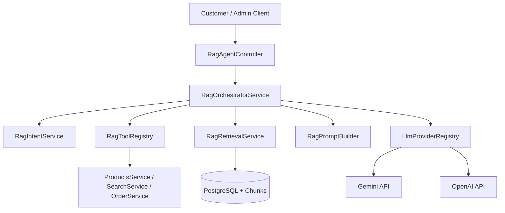
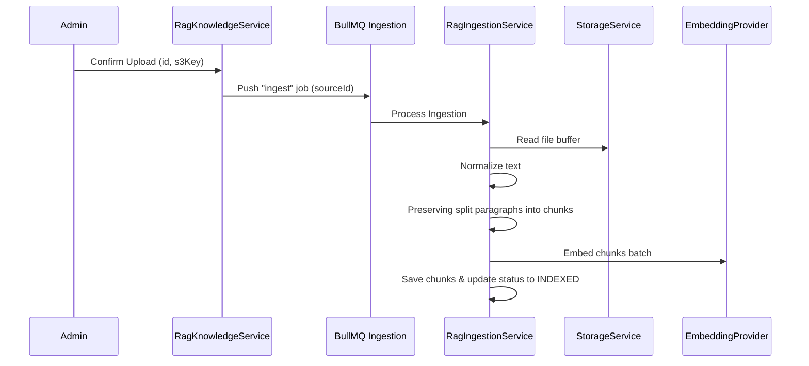

# RAG Agent Platform Backend Specification

This document details the architecture, workflows, environment setup, and security policies governing the RAG (Retrieval-Augmented Generation) Agent Platform backend for Vasanthi Designers.

---

## 1. System Architecture



---

## 2. Environment Variables Configuration

Add the following environment settings to your `.env` files:

```bash
# Activation Flag
RAG_ENABLED=true
RAG_DEFAULT_AGENT_KEY=customer_support_agent

# Text processing defaults
RAG_CHUNK_SIZE=800
RAG_CHUNK_OVERLAP=120

# Retrieval limits
RAG_TOP_K=8
RAG_MIN_RELEVANCE_SCORE=0.65
RAG_MAX_CONTEXT_CHUNKS=6

# Conversational memory
RAG_CONVERSATION_HISTORY_LIMIT=12
RAG_TOOL_MAX_EXECUTIONS=5

# Fetch & Crawling settings
RAG_URL_FETCH_TIMEOUT_MS=10000
RAG_URL_MAX_REDIRECTS=3
RAG_URL_MAX_CONTENT_BYTES=5242880

# Provider API Keys (leave empty to fallback to development simulated responses)
GEMINI_API_KEY=mock_key
OPENAI_API_KEY=mock_key
```

---

## 3. Database Schema

Tables introduced by this migration:
- **`rag_agents`**: Declares agents metadata, behavior configs, prompt definitions, parameters.
- **`rag_knowledge_sources`**: Records data feeds like CMS static pages, FAQs, custom URLs, files.
- **`rag_agent_knowledge_sources`**: Composite key mapping linking knowledge bases to agents.
- **`rag_documents`**: Represents documents mapped to source files/crawls.
- **`rag_document_chunks`**: Chunks content text and stores numerical float array embeddings.
- **`rag_conversations`**: Tracks conversations with status markers.
- **`rag_messages`**: Chat history linked to conversation streams.
- **`rag_message_citations`**: Grounded document excerpts mapped to individual assistant messages.
- **`rag_tool_executions`**: Audited records of dynamic tool triggers.
- **`rag_agent_metrics`**: Aggregated daily token counts, response times, feedback, errors.
- **`rag_feedback`**: Ratings and comments logged by users.

---

## 4. Ingestion Workflow Pipeline



---

## 5. Security & Authorization Matrix

| Access Pattern | Guard | Authorization Principle |
| :--- | :--- | :--- |
| **Crawl URLs** | DNS resolve | Blacklists loopbacks (`127.0.0.1`), private IP ranges, cloud metadata endpoints to prevent SSRF. |
| **Document Uploads** | S3 Prefix path match | Enforces `rag/knowledge/{sourceId}/` prefix structure. Prevents key injection. |
| **Order Queries** | Tool layer verification | Authenticated `userId` must match `order.customerId`. Guests are strictly blocked. |
| **Message History** | Controller layer verification | Authenticated customer can only pull messages from their own conversations. |
| **Agent / Knowledge CRUD** | RBAC Guard | Restricted exclusively to `admin` and `super_admin` roles. |
| **Prompt Injection** | PromptBuilder ground rules | Grounding prompts instruct LLM to parse context chunks strictly as data inputs, never instructions. |

---

## 6. API Endpoints Catalog

### Customer APIs
- `POST /api/v1/ai/agent/chat`: Send prompt questions (supports guests).
- `GET /api/v1/ai/agent/conversations`: Fetch conversation listings.
- `GET /api/v1/ai/agent/conversations/:id`: Retrieve chat transcript history.
- `DELETE /api/v1/ai/agent/conversations/:id`: Soft delete / archive chat thread.
- `POST /api/v1/ai/agent/messages/:messageId/feedback`: Submit feedback ratings.

### Admin APIs
- `GET /api/v1/admin/rag/agents`: List all configured agents.
- `GET /api/v1/admin/rag/agents/:id`: Detailed agent properties.
- `POST /api/v1/admin/rag/agents`: Create agent config.
- `PUT /api/v1/admin/rag/agents/:id`: Update agent settings.
- `DELETE /api/v1/admin/rag/agents/:id`: Soft delete agent.
- `POST /api/v1/admin/rag/agents/:id/restore`: Restore deleted agent.
- `PUT /api/v1/admin/rag/agents/:id/status`: Toggle status (`ACTIVATE`/`DEACTIVATE`).
- `PUT /api/v1/admin/rag/agents/:id/knowledge-sources`: Link knowledge resources.
- `PUT /api/v1/admin/rag/agents/:id/tools`: Configure permitted service tools.
- `POST /api/v1/admin/rag/agents/:id/test`: Admin query test runner.
- `GET /api/v1/admin/rag/knowledge-sources`: List knowledge feeds.
- `GET /api/v1/admin/rag/knowledge-sources/:id`: Ingestion status details.
- `POST /api/v1/admin/rag/knowledge-sources`: Create crawler/text source.
- `POST /api/v1/admin/rag/knowledge-sources/upload-url`: presigned S3 document link.
- `POST /api/v1/admin/rag/knowledge-sources/:id/confirm-upload`: Finalize S3 document link.
- `POST /api/v1/admin/rag/knowledge-sources/:id/reindex`: Trigger manual indexing.
- `GET /api/v1/admin/rag/analytics/summary`: General dashboard counts.
- `GET /api/v1/admin/rag/analytics/agents/:agentId`: Detailed token usage summaries.
- `GET /api/v1/admin/rag/analytics/intents`: Retrieve top intent frequencies.
- `GET /api/v1/admin/rag/conversations`: Admin audit conversation records.
- `GET /api/v1/admin/rag/conversations/:id`: Detailed admin conversation message listing.
